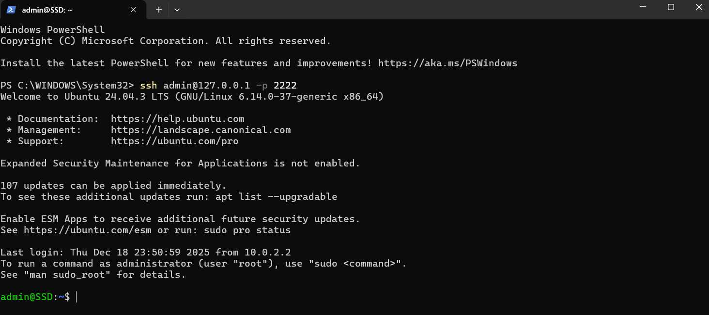
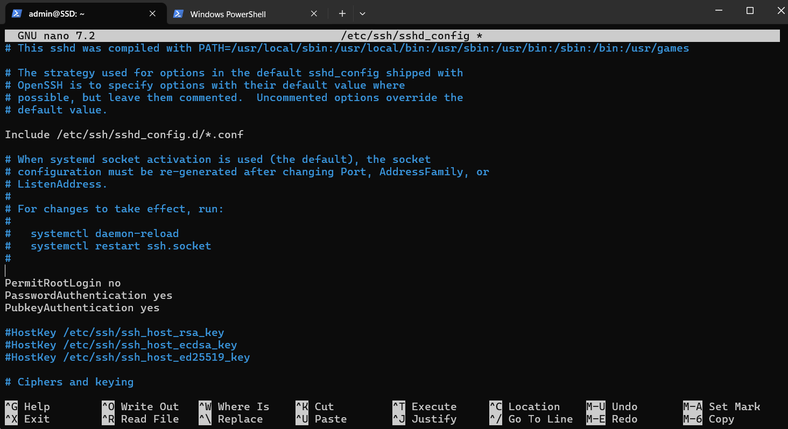
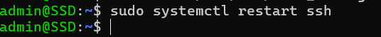
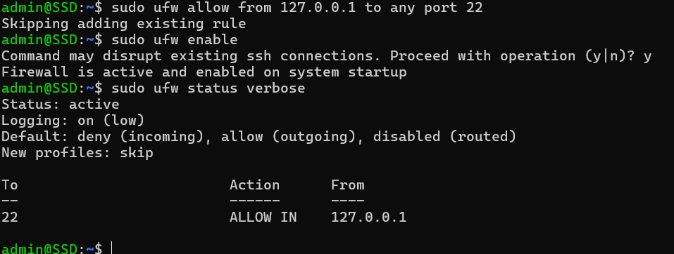
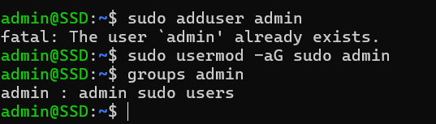

# Week 4 – Initial System Configuration and Security Implementation

## 1. Introduction

The objective of Week 4 was to deploy the Ubuntu Server and implement foundational security controls. This phase focused on enabling secure remote administration, managing user privileges, and restricting network access in line with best practices.

All configuration tasks were carried out remotely via SSH from the Windows workstation, in compliance with the administrative constraint specified in the coursework brief.

---

## 2. SSH Configuration with Key-Based Authentication

Secure Shell (SSH) is used as the primary method of remote administration. SSH provides encrypted communication between the workstation and the server.

Key-based authentication was enabled to improve security by reducing reliance on passwords and mitigating brute-force attacks.

*ssh admin@127.0.0.1 -p 2222*
This command was used to successfully establish a remote SSH session from Windows PowerShell.
Evidence:

### SSH configuration file:

*sudo nano /etc/ssh/sshd_config*

#### Relevant configuration before changes:

#### Configuration after changes:

These settings disable root login while enabling public key authentication. Password authentication remained enabled to prevent accidental lockout during coursework testing.

The SSH service was restarted to apply changes:

*sudo systemctl restart ssh*

## 3. Firewall Configuration (Restricted SSH Access)

A firewall was configured using UFW (Uncomplicated Firewall) to restrict incoming connections. Only SSH traffic from the trusted workstation was permitted.

Because the server is hosted in VirtualBox using NAT with port forwarding, the trusted source IP is the localhost address.

Firewall rules applied:

*sudo ufw allow from 127.0.0.1 to any port 22
sudo ufw enable*

All other incoming connections are denied by default.

Firewall ruleset verification:
*sudo ufw status verbose*

This confirms that SSH access is restricted to a single trusted source.
Evidence:

## 4. User and Privilege Management

To follow the principle of least privilege, a non-root administrative user named **admin** was created.

User creation:

*sudo adduser admin*

Assigning administrative privileges:

*sudo usermod -aG sudo admin*

Group membership was verified using:

*groups admin*

This confirms that the user has controlled administrative access via **sudo**.
Evidence:

