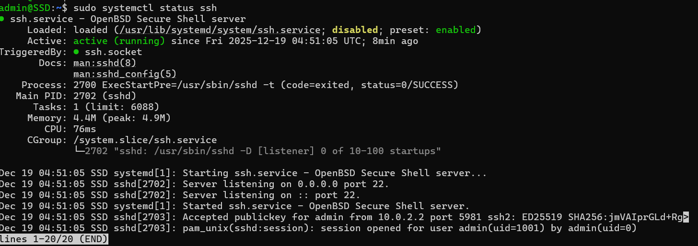
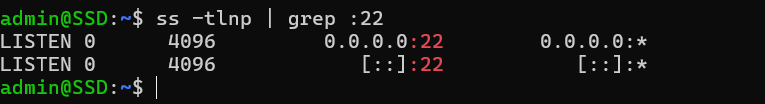

# Week 4 – Initial System Configuration and Security Implementation

## 1. Introduction

The objective of Week 4 was to deploy the Ubuntu Server and implement foundational security controls. This phase focused on enabling secure remote administration, managing user privileges, and restricting network access in line with best practices.

All configuration tasks were carried out remotely via SSH from the Windows workstation, in compliance with the administrative constraint specified in the coursework brief.

---

## 2. SSH Configuration with Key-Based Authentication

Secure Shell (SSH) is used as the primary method of remote administration. SSH provides encrypted communication between the workstation and the server.

Key-based authentication was enabled to improve security by reducing reliance on passwords and mitigating brute-force attacks.

*ssh admin@127.0.0.1 -p 2222*

This command was used to successfully establish a remote SSH session from Windows PowerShell.

Evidence:

A successful login confirmed:

* SSH service availability
* Correct port forwarding
* Proper user authentication
* Secure remote administration

## SSH Service Verification

The SSH service was checked to ensure it is running correctly and listening for incoming connections.

*sudo systemctl status ssh*

The output confirmed that the SSH service is active and running.

*ss -tlnp | grep :22*

This command confirmed that the server is listening on port 22 for SSH connections.

Evidence:
Screenshots showing SSH service status and listening port.

### SSH configuration file:

*sudo nano /etc/ssh/sshd_config*

#### Relevant configuration before changes:

#### Configuration after changes:

These settings disable root login while enabling public key authentication. Password authentication remained enabled to prevent accidental lockout during coursework testing.

The SSH service was restarted to apply changes:

*sudo systemctl restart ssh*

## 3. Firewall Configuration (Restricted SSH Access)

A firewall was configured using UFW (Uncomplicated Firewall) to restrict incoming connections. Only SSH traffic from the trusted workstation was permitted.

Because the server is hosted in VirtualBox using NAT with port forwarding, the trusted source IP is the localhost address.

Firewall rules applied:

*sudo ufw allow from 127.0.0.1 to any port 22*  
*sudo ufw enable*

All other incoming connections are denied by default.

Firewall ruleset verification:
*sudo ufw status verbose*

This confirms that SSH access is restricted to a single trusted source.

Evidence:

## 4. User and Privilege Management

To follow the principle of least privilege, a non-root administrative user named **admin** was created.

User creation:
* *sudo adduser admin*

Assigning administrative privileges:
* *sudo usermod -aG sudo admin*

Group membership was verified using:
* *groups admin*

This confirms that the user has controlled administrative access via **sudo**.

Evidence:

#### Principle of Least Privilege

The system follows the principle of least privilege by:

* Using a dedicated administrative user
* Disabling root login over SSH
* Granting sudo access only when required

This reduces the risk of accidental or malicious system changes.

### Evidence Summary

The following screenshots were collected as evidence:

* SSH service running
* SSH configuration file settings
* User creation process
* Sudo group membership
* Successful remote SSH login from Windows

All evidence demonstrates correct implementation of secure access and user management.
 
 ## Outcome of Week 4
By the end of this phase:

* Secure remote access is fully operational
* User privileges are correctly managed
* Administrative access follows best practices
* The system is prepared for further security configuration and testing

This completes the secure access and user management phase of the coursework.
