# Week 5 – Advanced Security and Monitoring

## 1. Overview
This week focused on implementing advanced security controls and monitoring capabilities on the Ubuntu Server. All administration was performed remotely via SSH from the Windows workstation. The goal was to strengthen the server security baseline and prepare for performance testing in Week 6.

---

## 2. Automatic Security Updates (Unattended Upgrades)
Unattended upgrades were enabled to ensure security patches are applied regularly.

**Evidence**
- 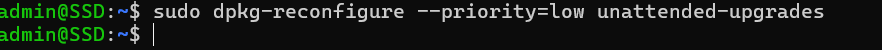
- 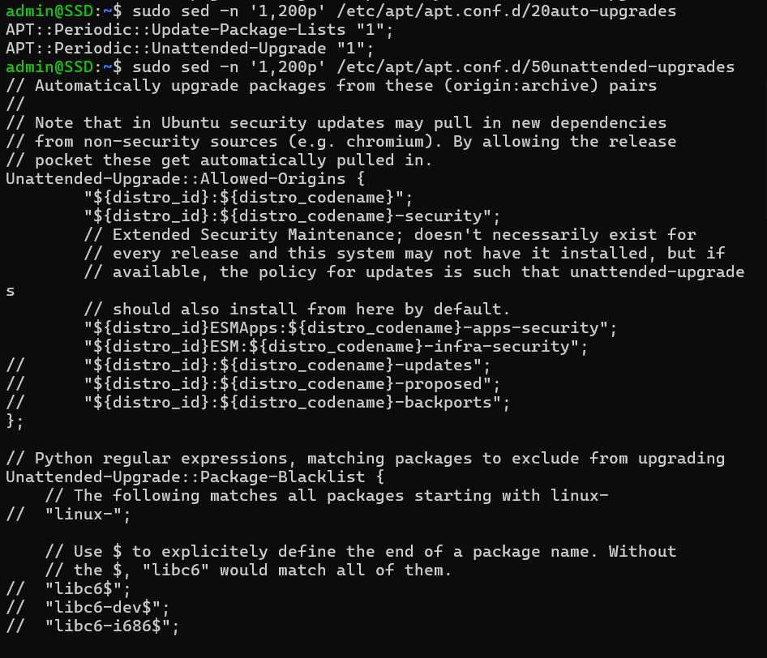
- 
- 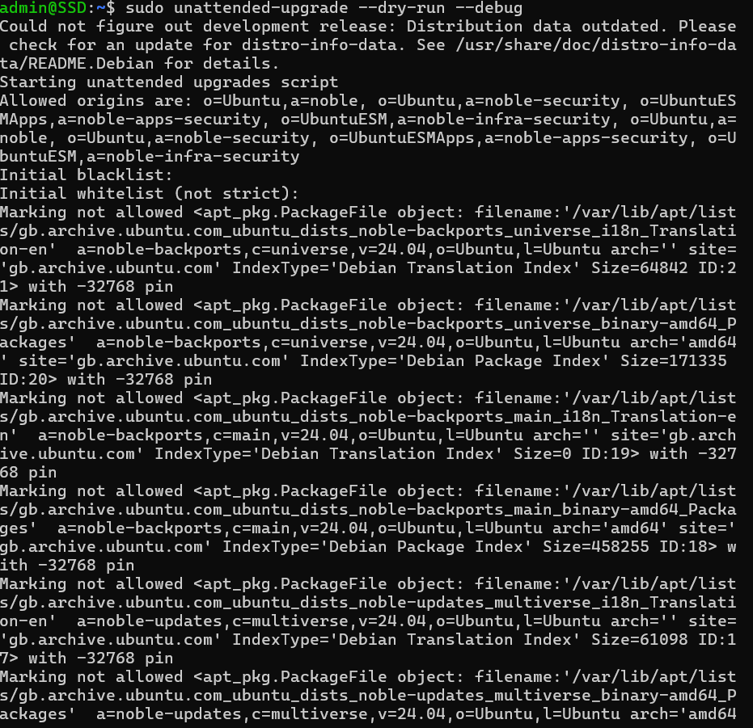

---

## 3. Mandatory Access Control (AppArmor)
AppArmor was verified as active and a service profile was placed into enforce mode to restrict application permissions.

**Evidence**
- 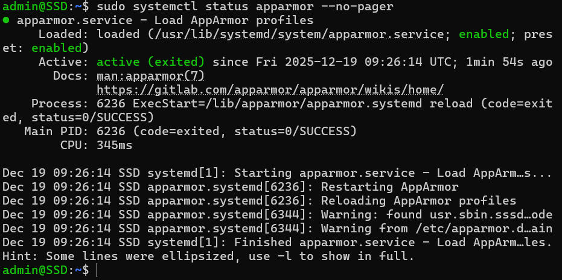
- 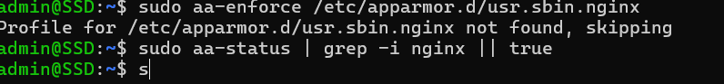

---

## 4. Intrusion Prevention (fail2ban)
fail2ban was configured to protect SSH by banning repeated failed login attempts. A local jail configuration was created and the sshd jail status was verified.

**Evidence**
- 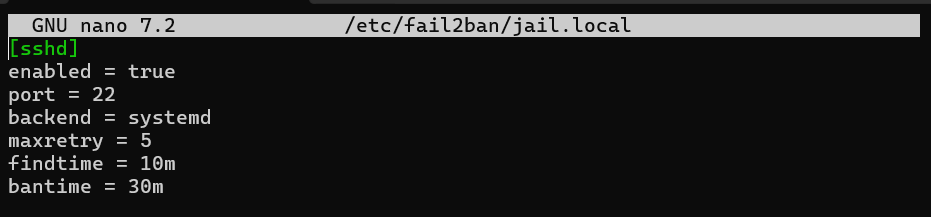
- 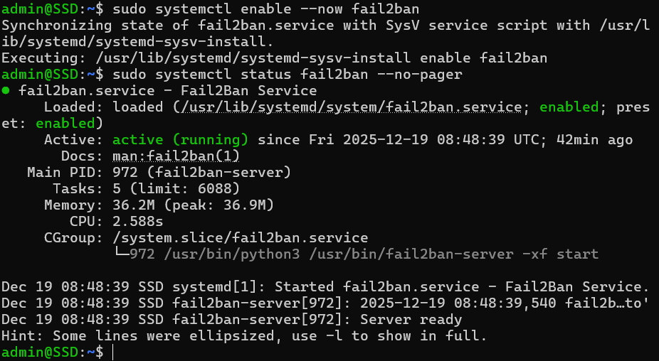
- 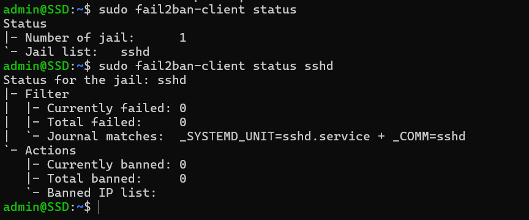

---

## 5. Audit Logging (auditd)
auditd was enabled to support security monitoring by recording key system events.

**Evidence**
- 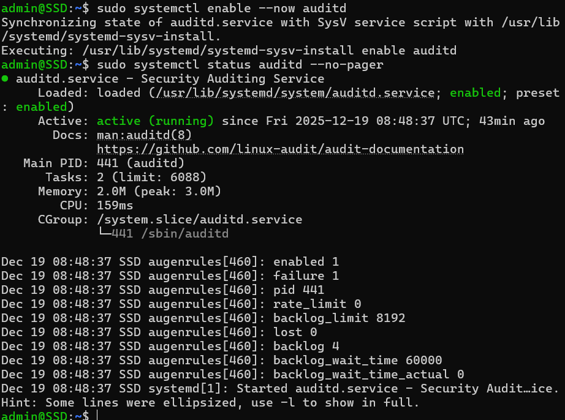

---

## 6. Security Baseline Script (Server)
A script was created to check the security baseline and report the current configuration of SSH, firewall, AppArmor, fail2ban, and updates.

**Evidence**
- 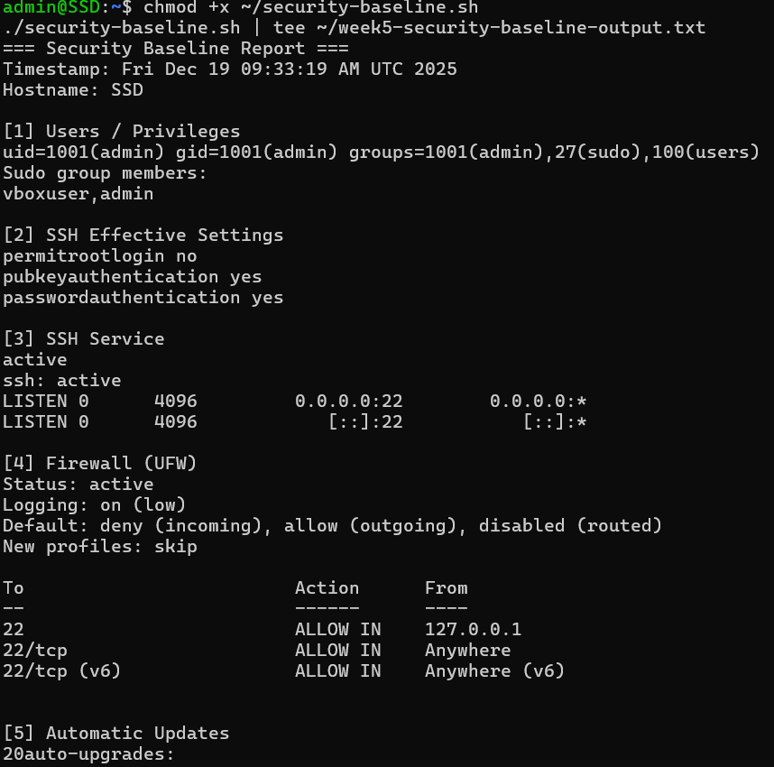

---

## 7. Remote Monitoring Script (Workstation)
A monitoring script was run from the Windows workstation to collect CPU load, memory usage, and disk utilisation at intervals over SSH. The CSV output will be reused in Week 6 for graphs and comparisons.

**Evidence**
- 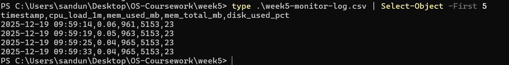

---

## 8. Reflection
This week improved my understanding of practical server hardening. Implementing automatic updates, AppArmor, and fail2ban reduced the risk of common attacks. Creating baseline and monitoring scripts also helped make the system easier to verify and evaluate consistently in later testing.
