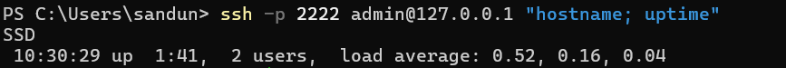
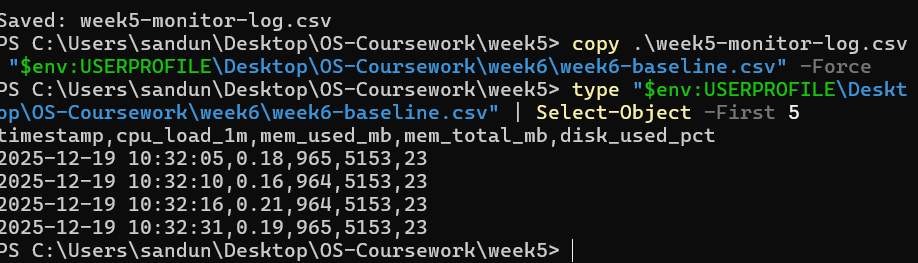
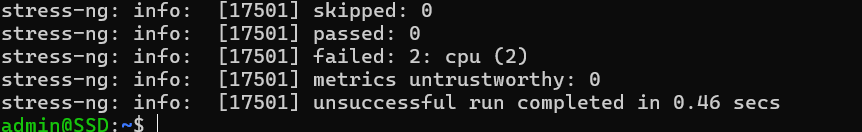

# Week 6 – Performance Evaluation and Optimisation

## Aim
This week focuses on collecting performance evidence from the Ubuntu Server using remote monitoring and producing graphs that show system behaviour under different workloads. All administration and testing is performed remotely via SSH from the Windows workstation.

---

## 1) Test Setup
**Workstation:** Windows (PowerShell SSH client)  
**Server:** Ubuntu Server (VirtualBox, headless)  
**Remote Access:** SSH via forwarded port `2222`  
**Monitoring Output:** CSV logs generated on Windows and used for graphs.

---

## 2) Monitoring Method
Monitoring was done remotely from the workstation by repeatedly collecting key server metrics and saving them to CSV:

- CPU load (1 minute load average from `/proc/loadavg`)
- Memory usage (MB from `free -m`)
- Disk usage percentage (`df -P /`)

The monitoring script was executed from Windows to satisfy the coursework constraint (remote administration only).

   
 

## CPU Load Test (stress-ng)
A controlled CPU stress test was performed using `stress-ng` to observe CPU load changes and any secondary impact on memory or disk usage.

Command used:
stress-ng --cpu 2 --timeout 180s --metrics-brief

